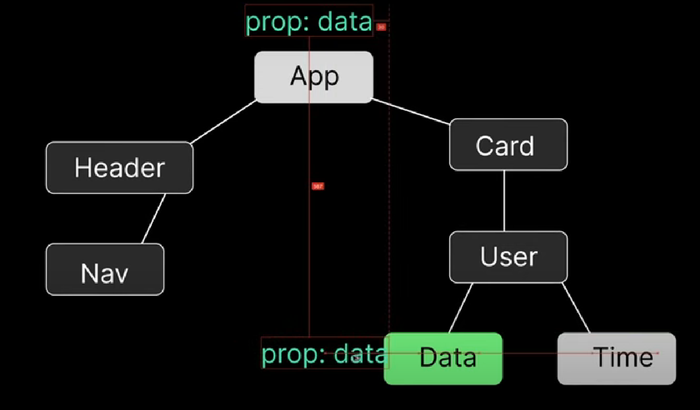

TOPICS TO BE COVERED IN VUE COURSE :
 
 * What is Vue.js?
 * Component In Depth
 * Text Interpolation
 * Attribute Bindings
 * Dynamic Bindings
 * Styling In Depth
 * Event Handlers In Vue
 * Reactivity & Reactive
 * ref()
 * Computed Properties
 * Conditional Rendering
 * v-for 
 * v-model
 * Props
 * Component Event
 * Slots
 * Provide & Inject
 * Lifecycle Hooks
 * Watchers ...
 * Template Ref...
 * Async Components...
 * Composables
 * Custom Directives....
 * Dynamic Components
 * Data Fetching In Vue
 * Project 1
 * Project 2
 * Project 3
 * Project 4
 * Project 5
 * Project 6
 * Project 7
 * Project 8
 * Project 9
 * Project 10
 * Outro

 
 
 

<h2>
Any Components have three parts in VUE: </h2>

html

    <template>
      //html code
    </template>

css

    

js

    

<h2>Text-Interpolation</h2>

it refers to the process of dynamically binding -data to the content of an HTML element in ur template. It allows u to display the value of a js expression or a variable within the markup.
    
    <!-JS-->
     

    <!-- html -->
    <template>
     <h1>{{ message }} </h1>
     <h2>{{ Number }}</h2>
     <h2>2+2 ={{2+2 }}</h2>
     <h2>Add the numbers : {{ add(5,6)  }}</h2>
     
    </template>

<h2>
  ATTRIBUTE BINIDNGS :</h2>

  Attribute binding is a way to bind HTML attributes to data in Vue instance.    

  two ways :

  *  v-bind : attr
  *    : attr

     

      <template>

          <a :href="myChannel">Huxn Channel</a>
          
         
       </template>

<h2>

DYNAMIC BINDING :</h2>

       

        <template>
         
         <?template>
    

 
<h2>STYLING IN VUE JS :</h2>

                KABAB-CASE SYNTAX

      <template>
    <h1 :class="$style['m1-red']">
    Using Module css,This is the syntax of kabab case, are you exited</h1>
    </template>
    
    

               
                CamelCase SYNTAX :
  

       <template>
       <h1 :class='$style.anotherClass'>using Module css with $ syntax (camelcase)</h1>
        </template>

         
<h2> REACTIVITY :</h2>

Reactivity means that the framework can automatically update (UI) when the information behind it changes. Its a core concept that allows u to create dynamic and Responsive applications without manually manipulating the DOM.

<h2>Reactive state</h2>

* reactive()
* ref()

<h2>REF() :</h2> ref() is used to crete a reactive reference to a value. Unlike the reactive function, which is uesed for creating reactive objects, ref is specifically designed for creating reactive single value.

                
                  Example 1 :

        
      
      <template>
      
          <h1>count :  {{ count }} </h1>

         <button v-on:click="count++">Increment</button> 

         <button @:click="decrement">decrement</button> 
         
      </template>

                    EXAMPLE 2

                

          
          
          <template>
              <h3>Current Count : {{ initialState.val.count }}</h3>
              <h3>Current User : {{ initialState.user }}</h3>
             <button @click="initialState.val.count += 10">Add 10</button>
             <button @click="changeUser">Change user</button>
             <button @click="initialState.user.push('Zain')">Add User</button>
          </template>

              Example (3)
        

        
        
        <template>
            <h1>Name : {{ userInfo.name }}</h1>
            <h1>Age   : {{ userInfo.age }}</h1>
            <h1>Location :{{ userInfo.location }}</h1>
            <h1>IsMarried : {{ userInfo.isMarried }}</h1>
        
            <button @click="userInfo.name='Huxn'">Change Name</button>
            <button @click="userInfo.age=40">Change Age</button>
            <button @click="userInfo.location=['Earth','meh']">Change Location</button>
            <button @click="userInfo.isMarried=true">Change Married status</button>
        </template>

                    Example 4:

                    
      
      
      
      <template>
         <h3>1 : {{friends[0]}}</h3>
         <h3>2 : {{friends[1]}}</h3>
         <h3>3 : {{friends[2]}}</h3>
      </template>
      

        

<h2>
EVENT HANDLER :</h2>

                Example (1) :
        
        
        
        <template>
          <form @:submit="submitHandler">
            <input type="text" placeholder="Enter your name here" />
            <input type="e-mail" placeholder="Enter your e-mail here" />
           <button type="submit">SUBMIT</button>
          </form>   
        </template>

                Example (2) :

            
            
            <template>
                <button @:click="showmessage('This is the message')">Show message</button>
            </template>
            

 

<h2>COMPUTED PROPERTIES :</h2>

A computed property is a special kind of variable that automatically updates itself whenever the data it depends on changes.

It's like a little worker that watches certain data, performs some work on it, and always gives you the most up-to-date result.

                    Example 1
     
             
     
     
     <template>
         <h3>original num : {{ number }}</h3>
         <h3>Squared num : {{ squaredNum }}</h3>
     </template>
     
                    Example 2

                       
       
       
       <template>
           <h1> FullName : {{ FullName }}</h1>
       </template>

                Example 3

                
      
      
      
      
      
      <template>
              
counter : {{ counter }}

              
Squared counter : {{ sqrc }}

      
              <button @click="IncrC">Increment</button>
            
      </template>
      
<h2>CONDITIONAL RENDERING :</h2>

Conditional rendering is refers to the ability to conditionally displayy or hide elements in the user interface based on certain conditions or expressions.
     
* v-if (condition)
* v-else-if (condition)
* v-else

            EXAMPLE 1

                    
        
        
        
        
        <template>
            

                
This will show if isTrue is true

                
This will show if isFalse is true

                
This will show if neither isTrue is true nor isFalse is true, 

            
   
        </template>

* <h2>v-show :</h2>

 v-show directive is used for condtional rendering. It "toggles the visibilty" of an element  based on the truthiness of the provided expression. Unlike v-if, which completely adds or removes the element from the DOM, V-SHOW toggles the css display property of the element to control its visibilty while keeping it in the DOM.
 
            

        

        <template>
            
This paragraph will be shown or hidden on the value of vsibility....

            <button>Toggle Visibility</button>      
        </template>

    
 
           
           
           
           
           <template>
               
This paragraph will be shown or hidden on the value of vsibility....

               <button @click="isVisible =! isVisible">Toggle Visibility</button>      
           </template>

          
          
          
          
          
          <template>
            <h1 v-if="isuserLoggedin">Welcome, {{ userName }}</h1>
            
Please log in to access this content

            

              <h4> YOU ARE NOW ABLE TO MODIFY UR DASHBOARD</h4>
            

          </template>

             
     
     
     
     <template>
      <h1 v-if="password.length > 8">Strong password</h1>
      <h1 v-else-if='password.length < 8'    >Weak password</h1>
      <h1 v-else>Please enter your Password</h1>
     </template>

<h2>V-FOR</h2>

The v-for directive is used to iterate over an array or an object and render a template for each item in the collection.

<h3>Basic syntax :</h3>

    

    <template>

    
{{person}}

    </template>

 

 <h2>WHY : KEY ?</H2>

<h3>Efficient dom updates</h3>

 *  when view renders a list of elements, it uses a virtual DOM to determine the most efficient way to update the actual dom.  The key helps VUE identify which elements have changed, been added or been removed.

 * without keys ,vue may need to recreate the entire dom structure for each update which can be less efficient
 <h3>Avoiding common pitfalls</h3>

* using key can help avoid common pitfalls such as duplicate key warnings in the console or incorrect rendering when items are rearranged in the list.

* Vue relies on keys to track the identity of element and using unique case for each item and shares that VUE can accurately update the Dom based on changes in the list

           
           
           
           
           <template>
              
{{ content }}

               <ul v-for="({firstName,lastName,age,eyeColor},i) in details" :key="i">
    
      
      <li> First Name : {{ firstName }}</li>
      <li> Last Name : {{ lastName }}</li>
      <li> Age : {{ age }}</li>
      <li> Eye colour : {{ eyeColor }}</li>
       </ul>  
      </template>

        

          
          
          
          
          <template>
             <ul v-for="(sahaba,i) in SahabaNames" : key="i">
              <li v-for="(s,index) in sahaba" :key="index">{{  s }}</li>
             </ul>
          </template>
          

    

       
       
       
       
       <template>
            <ul v-for='(game,index) in complexobj' :key='index'>
               <!--Getting all the objects here-->
               <li>{{ game }}</li>
                
                <!--Getting Value from objects here-->

        <li v-for="(property,i) in game" :key='i'>{{ property }}</li>
            </ul>
       </template>
       

       
               
       
       
       
       <template>
         <ul v-for="number in 5" :key="number">
           <li>{{ number }}</li></ul>
       </template>
       

<h2>V-MODEL :</h2>

v-model is a directive that provides two way data binding on an input,textarea, or select element. It creates a connection b/w the data in your component and the input field, allowing changes in one to automatically update the other and vice versa.

<h2>Two way data binding</h2>

Two-way binding means that changes in your code automatically update what you see on the screen, and vice versa. It's like a live connection b/w ur data and the user interface, making it easy to keep them in sync without writing a lot of extra code.

          
    
    
    
    
    <template>
    
    <form @submit.prevent>
      <input type="text" placeholder="Please enter your Name" v-model="formData.username">
      <input type="email" placeholder="Please enter your email" v-model="formData.email">
      <input type="password" placeholder="Please enter your password" v-model="formData.password">
      <button type="submit">submit </button>
    </form>
    
    <h1>{{ formData.username }}</h1>
    <h1>{{ formData.email }}</h1>
    <h1>{{ formData.password }}</h1>
    
    </template>
    

<h2>PROPS : </h2>

it is a way to pass data from a parent component to a child component. PRops allows u to communicate b/w components by allowing the parent component to pass data down to its child components. This is useful for creating reusable and modular components.

* Props are <b>IMMUTABLE</b>, means its values are un changeable

          
          
          
          
          
          <template>
            <h1>{{ props.name }}</h1>
            <h1>{{ props.class }}</h1>
          </template>
          
          app.vue : 
          <StaticPropsComp name="jordan" class="second"/>

      
      
      
      
      
      <template>
        <h1>{{ props.firstName }}</h1>
        <h1>{{ props.lastName }}</h1>
      </template>
      
      App.vue : 
      
      
      import { ref } from 'vue';
      
      const firstName=ref('Mahvish')
      const lastName=ref('Fatima')
      
      </script>
      
      <template>
       <StaticPropsComp name="jordan" class="second"/>
       <DynamicPropsComp :firstName="firstName" :lastName="lastName"/>
      </template>
      
      

  <h2> Props Validation : </h2>

  Basic validation example : 
   
       
     
     
     <template>
         <h3>{{ props.name }}</h3>
         <h3>{{ props.age }}</h3>
     </template>

     (App.Vue)

      
    <PropValidation name="20" age="mahvish"/>
    
      

   Complex validation example : 

                    EXAMPLE 1
        
        
     
     
     <template>
         <h3>{{ props.name }}</h3>
         <h3>{{ props.age }}</h3>
     </template>
     
      (App.Vue)
      
     <template>
      <PropValidation name="mahvish" :age=20 />
     </template>
    

                   EXAMPLE (2)

        
    
    <template>
        <h1>{{  friends }}</h1>
        <h1>{{  userInfo }}</h1>
    
        

    
        <ul v-for="(friend,index) in friends" :key="index">
            <li>{{  friend }}</li>
        </ul>
        <ul v-for="(info,i) in userInfo" :key="i">
            <li>{{  info }}</li>
        </ul>
    </template>

    {APP.VUE}

    
     <template>
      <ComplexProps :friends="['alex','john','huxn']" :userInfo="{ name : 'alex' , age: 20, location:['Earth','IDK']}" />
     </template>
     
    
<h3>Custom validator props :</h3>
    
    
    
    <template>
        <h1>Name : {{ name  }}</h1>
        <h1>Age : {{ age  }}</h1>
        <h1>password : {{ password }}</h1>
    </template>
    
    (APP.VUE)
    
    <template>
     <customValidator name="Mahvish" age:20 password="impos"/>
    </template>
    

  <h2> Component Event : </h2>

  component events are a way for child components to communicate with thier <b>parent components.</b>They allow child components to emit events( custom events) that can be listened to and handled by their parent components.

  
* <h3>Child component Emits an event:</h3>

Inside a child component, you can use the $emit method to trigger a custom event. This event can carry data that you want to send to the parent.

* <h3>Parent Component Listens to the event : </h3>

In the parent component's template, u can use the v-on directive (or the shorthand @ ) to listen for the custom event emitted by the child.

<h3>Example  :</h3>
    
    (App.vue)->parent component :
    
    
    
    <template>
    <h1>count : {{ count }}</h1>
        <CompEvent @incrementCount="count++"/>
    </template>
    
    (CompEvent.vue)->children component :
    
    
    
    <template>
        <button @click="$emit('incrementCount')">+</button>
    </template>

<h3>Example no. 2 : </h3>

               children component :

    
    
    <template>
        <form @submit.prevent="$emit('userInfo',username, email, password)">
            <input type="text" v-model="username" />
            <input type="email" v-model="email" />
            <input type="password" v-model="password" />
            <button type="submit">submit</button>
        </form>
    </template>
    
                    Parent component
    
            
    
    <template>
        <fromComp @userInfo="formHandler" />
    </template>
    

<h2>SLOT</h2>

A slot is like a <b>space in a component</b> where u can put d/f things. It allows u to create d/f content while maintaining a consistent structure.

    
    <template>
        <!--Creating a slot-->
    
        <slot>
            <h3>content 1</h3>
            <h3>content 2</h3>
            <h3>content 3</h3>
        </slot>
    </template>
    
    {APP.VUE}
    
    <template>
        <slotComp>
            
        </slotComp>
    </template>

<h2>Fallback/Default Content : </h2>

Fallback content in slots refers to the default content that is displayed when no content is provided for a particular slot. It's a way to ensure that a component still has meaningful content, even if the parent component does not pass any content to a specific slot.
    
    
    
    <template>
             <slot>
           
            </slot>
    </template>
    
    {App.vue}------->
    
    
    <template>
       <FallbackContent>
        
this is not a default

        </FallbackContent>
    </template>

<h2>Named slots : </h2>

A named slot is a way to <b>assign a specific name</b> to a slot, which is unnamed and used when no explicit name is provided, anmed slots allow u to have multiple slots in a component and specify where the content should be inserted based on the slots name.
    
    
    <template>
     <slot name="one">
        
     </slot>
     <slot name="two">
        
     </slot>
    </template>
    
                    {APP.VUE}
    
    
    
    <template>
        <NamedSlot>
             <!-- V-SLOT:ONE -->
              <template v-slot:one>
                <h1>This content will got to slot "one"</h1>
              </template>
             <!-- V-SLOT:two -->
              <template v-slot:two>
                <h1>This content will got to slot "two"</h1>
              </template>
         </NamedSlot>
    
    </template>

<h3>DEFAULT SLOTS :</h3>

    
    <template>
       <DefaultSlot>
            <template #default>
                <h1>This is a random default content</h1>
            </template>
       </DefaultSlot>
    
    </template>
    
        { component }
    
    <template>
     <slot>
     </slot>
    </template>

<h2>PROVIDE & INJECT</h2>

The provide and inject options rv used for providing and injecting properties or data <b> down the component</b> hierarchy.
They enable a form of dependency injection, allowing a parent component to provide data or methods that child components can them inject and use.

<h2>PROVIDE :</h2>

Provide is an option in a parent component that allows it to share data or methods with its child components. It makes properties or methods available for injection into child components.

<h2>Injection :</h2>

Inject is an option in a child component that specifies which properties or methods it wants to recieve from its parent component. It allows a component to inject and use provided data or methods. 

<h3>Example of nested components sharing data widout PROVIDE & INJECTION method : </h3>

                    {App.vue}
    
    
    
    <template>
       <SchoolComp :stdname="stdname" :stdAge="stdAge" :stdLocn="stdLocn"/>  
    </template>
    
               {component 1 :}
    
    
    
    <template>
        <StdComp  :stdname="stdname" :stdAge="stdAge" :stdLocn="stdLocn" />
    </template>
    
    
                 {component 2 :}
    
     
    
    <template>
       <h1>{{ stdname }}</h1>
       <h1>{{ stdAge }}</h1>
       <h1>{{ stdLocn }}</h1>
    </template>

 
Ohhhhhh my god, theirs' a lot of pain here !!!! whats the solution of this??? hahahaha, the solution is Provide & Injection method,
    
    
                    {App.vue}
    
    
    
    
    <template>
       <SchoolComp />  
    </template>
    
              {component 1}
    
    
    
    <template>
       <StdComp />
    </template>
    
              {component 2}
    
    
    <template>
       <h1>{{ studName }}</h1>
       <h1>{{ studAge }}</h1>
       <h1>{{ studLoc }}</h1>
    </template>
    
    
Can u relate !!!!  How much pain and work reduces by here !!!! Hahhahahhahhaa !!!!!

                  Example 2
     
     {APP.VUE}
     
     
     
     <template>
        <PracticeComponent />
     </template>
     
                   {COMPONENT 1}
     
     
     
     <template>
         <h1>Injecting array</h1>
          <ul v-for='(friends,index) in frndslist' :key="index">
             <li>{{ friends }}</li>
          </ul>
          <h2>Injecting Games</h2>
          <ul v-for="(games,i) in games" :key="i">
             <li>{{ games }}</li>
          </ul>
          <h2>Injecting array of objects</h2>
          <ul v-for="(moregames,idx) in moreGames" :key="idx">
             <li>{{ moregames }}</li>
          </ul>
     </template>
     
<h2>LIFECYCLE HOOKS</h2>

Lifecycle hooks are special methods provided by Vue.js that allows u to execute code at d/f stages of a component's lifecycle. These hooks provide developers with the ability to perform actions or respond to events at specific points during the creation, updating ,and destruction of a vue component.

<h2>Mount</h2>
Mounting means when a component is being created and inserted into the DOM.
<h2>Un-Mount</h2>
Unmounting means when a component is being removed from the DOM.
<h2>OnBeforeMount()</h2>
Registers a hook to be called right before the component is to be mounted.
When this hook is called, the component has finished setting up its reactive state, but no DOM nodes have been created yet. Its about to execute its DOM render effect for the first time.
<h2>OnMounted</h2>
OnMounted is used for executing logic or actions after a component has been mounted to the dom, this hook is particularly useful for tasks that should occur once the component is ready to interact with the user such as fetching data, setting up event listeners, or performing initial calculations.
<h2>OnBeforeUpdate</h2>
Registers a hook to be called right before the component is about to update its dom tree due to a reactive state change. This hook can be used to access the Dom state before vue updates the dom.It is also safe to modify component state inside this hook.
<h2>OnUpdated</h2>
Registers a callback to be called after the component has updated its dom tree due to a reactive state change.
This hook is called after any DOM update of the component, which can be caused by different state changes, because multiple state changes can be batched into a single render cycle for performance reasons.
<h2>OnBeforeUnmount</h2>
Registers a hook to be called right before a component instance is to be unmounted.
When this hook is called,the component instance is still fully functional.
<h2>OnUnmounted</h2>
Registers a callback to be called after the component has been unmounted.
Use this hook to clean up manually created side effects such as timers, dom event listeners or server connexions.

<h3>Example : </h3>
    
    
    
    <template>
    
{{ message }}

    <button @click="updateMessage">click me</button>
    </template>

    {APP.VUE}

    
     
     <template>
        <LifeCycle v-if="showHide" />
        <button @click="showHide=!showHide">show / Hide</button>
     </template>

<h2>WATCHERS</h2>
Watcher allows us to reactively watch for changes in a specific property or expression and perform some custom logic when that property or expression changes. watchers are part of veu js's reactivity system which enables the framework to automatically update the Dom when the underlying data changes.      

<h4>Syntax</h4>

watch(source,callback,options)
options is optional

<h4>Source supports :</h4>

* Ref()
* Reactive object
* Array
* Getter Function

<h4>callback</h4>

The callback fn is called whenever some data changes. 
watch (source,(newVal,oldVal)=>{ })
<h4>options support :</h4>

* immediate
* deep
* flush
* onTrack/onTrigger

<h2>Examples</h2>
    
    
    
    <template>
        

            <h1>{{ message }}</h1>
            <input v-model="inputText" placeholder="Type something...." />
        

    </template>

                    Example 2

        
    
    
    <template>
        <h1>{{  state.username }}</h1>
        <button @click="state.username='jordan'">Change name</button>
    </template>

         Example 3 ( for multiple sources)

      
    
    <template>
        <h1>{{ username }}</h1>
        <h1>count : {{ counter }}</h1>
        <button @click="username='HuXn'">Change name</button>
        <button @click="counter++">Increment by 1</button>
    
    </template>
    

<h2>Template Ref</h2>
A template ref is a way to create a <b>refernce to a child </b> component, element,or a DOM element within a template.
THis allows u to access and manipulate the referenced object directly in ur component's logic. Refs are commonly used to interact with child components,trigger imperative actions, or access properties and methods of DOM element.
<h3>EXAMPLES</h3>
    
  
  
                 Example 1

    
    
    <template>
        <input type="text"  ref="myRef">
    </template>

                  Example 2

    
    
    <template>
        <h1 :ref="myRefFunc">This is an initial value...</h1>
    </template>

                   Example 3
     

     {APP.VUE}
     
     
     
     <template>
        <MyComp/>
     </template>
     
     
                   {component 1}

     
     
     <template>
         <RefComp ref="myRef"/>
     </template>
     
     
                 {component 2}
     
     
     
     
     <template>
         <h1>COUNT : {{  count  }}</h1>
         <button @click="inc">+</button>
         <button @click="dec">-</button>
     </template>

<h2>Async Component</h2>
Async component is a feature that allows you to load a component case synchronously meaning the component is loaded and rendered only when it's needed, this is particularly useful for optimising the initial loading time of your application especially when dealing with large and complex components that might not be necessary on the first page load. 
<h2>defineAsyncComponent()</h2>
Is used to create asynchronous components.Async components are loaded and resolved asynchronously, which can be helpful for improving the initial loading performance of ur application by deferring the loading of certain components until they are actually needed.
<h3>syntax</h3>

defineAsyncComponent(()=>{
  import('./ComponentPath.vue')
})
<h3>EXAMPLE</h3>
    
                        
                         {APP.VUE}

    
    
    <template>
       <ToggleFrnds/>
    </template>
    
                   {COMP 1}

    
    
    <template>
    
        

            <RenderFrnds />
        

        <button @click="toggleFriends">Toggle frnds list</button>
    
    </template>

                   {COMP 2}
    
    
    
    
    <template>
    
        <h3 v-for="(frnd,index) in frnds" :key="index">{{ frnd }}</h3>
    
    </template>

<h2>Composable</h2>
A composable is a fn or set of functions that encapsulate a piece of logic and can be composed together to build the functionality of a vue component .Composables are designed to be <b>reusable and shareable</b> making it easier to manage complex logic and behaviour in a veu  application

<H3>EXAMPLE</H3>
    
                                   {app.vue}
   
    
    
    <template>
       <CounterComp/>
       <AnotherComp/>
    </template>

                                  {comp 1}
   
    
    
    <template>
        <h1>count : {{  count }}</h1>
        <button @click="inc">+</button>
        <button @click="dec">-</button>
    </template>
    
                                    {comp 2}

    
    
    
    <template>
       <CounterComp/>
    </template>

<h3>In order to create a seperate composable ,we create a composable folder named as 'shared' outside the component folder, but inside the src, --></h3>
    
          {shared--> useCounter.js}

    import { ref } from "vue";
    
    // counter composable
    export function useCounter(initialValue=0){
        const count=ref(initialValue)
        
      const inc=()=>count.value++
      const dec=()=>count.value--
    
      return { count, inc,dec}
    }
    
             {component 1}

    
    
    
    <template>
        <h1>count : {{  counter.count }}</h1>
        <button @click="counter.inc">+</button>
        <button @click="counter.dec">-</button>
    </template>
    

<h2>Custom Directives</h2>
Vue provides a set of built in directives such as V-if, V-model, etc. Custom directives allow you to define your own behaviour that can be applied to elements in the template.
<h2>How to create one</h2>
A custom directive is defined as an object containing life cycle hooks similar to component hooks eg: mounted , unmounted etc 
<h3>Examples</h3>
    
    
    
    <template>
      
Hey my name is mahvish ,how are you?
//just passing the argument as 4
    </template>
    
    
 <h3>Example 2</h3>

    
    
    <template>
      
Hey my name is mahvish ,how are you?

      
Hey my name is mahvish ,how are you?

      
Hey my name is mahvish ,how are you?

      
Hey my name is mahvish ,how are you?

      
Hey my name is mahvish ,how are you?

      
Hey my name is mahvish ,how are you?

    </template>

<h2>DYNAMIC COMPONENTS</h2>
Dynamic components refers to the ability to dynamically switch b/w different components based on certain conditions or user interactions. This is achieved using the component and there is attribute.

<h3>Example</h3>
    
                           {APP.VUE}
    
    
     
    
    <template>
       <MainComp/>
    </template>
    {MAIN.VUE}
    
    <template>
        <button @click="currentTab='Compone'">what is HTML?</button>
        <button @click="currentTab='Comptwo'">what is CSS?</button>
        <button @click="currentTab='Compthree'">what is JS?</button>
            
            <!--Dynamic Component-->
    
            <component :is="tabs[currentTab]"/>
    </template> 
    
    
                            {COMPONENT 1.VUE}
    
    
    
    <template>
        <h2>What is HTML?</h2>
        
Lorem ipsum dolor sit amet consectetur adipisicing elit. Delectus molestiae consequatur, necessitatibus adipisci quasi laborum voluptate exercitationem esse sequi impedit odio amet at voluptates quo totam doloribus expedita laboriosam, explicabo autem deserunt non molestias natus? Aut vitae perspiciatis nesciunt. Ipsam quae ullam id culpa? Dolorum officia libero ipsam non ad.

    </template>

                              {COMPONENT 2.VUE}
    
    
    
    <template>
        <h2>What is CSS?</h2>
        
Lorem ipsum dolor sit amet consectetur adipisicing elit. Delectus molestiae consequatur, necessitatibus adipisci quasi laborum voluptate exercitationem esse sequi impedit odio amet at voluptates quo totam doloribus expedita laboriosam, explicabo autem deserunt non molestias natus? Aut vitae perspiciatis nesciunt. Ipsam quae ullam id culpa? Dolorum officia libero ipsam non ad.

    </template>

                                  {COMPONENT 3.VUE}

    
    <template>
        <h2>What is JS?</h2>
        
Lorem ipsum dolor sit amet consectetur adipisicing elit. Delectus molestiae consequatur, necessitatibus adipisci quasi laborum voluptate exercitationem esse sequi impedit odio amet at voluptates quo totam doloribus expedita laboriosam, explicabo autem deserunt non molestias natus? Aut vitae perspiciatis nesciunt. Ipsam quae ullam id culpa? Dolorum officia libero ipsam non ad.

    </template>

<h3>Example</h3>
    
    
    
    <template>
       

        <h1>(( Using fetch))</h1>
        <button @click='fetchData'>Fetch Data</button>
       

       

        <h1>Data from API :</h1>
            <pre>{{ data }}</pre>
       

    </template> 

<h2>Example of FETCHING DATA (USING AXIOS)</h2>
    
    
    
    <template>
        <h1>(( Using AXIOS ))</h1>
        <button @click="fetchData">Fetch Data</button>
        

            <h2>Data from API : </h2>
            <pre>{{ data }}</pre>
        

    </template>